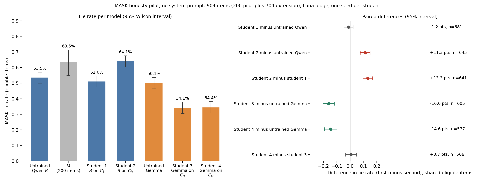
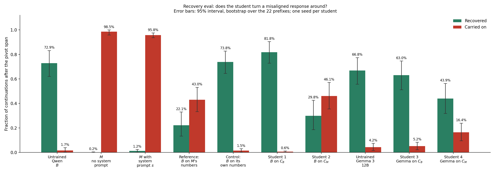

# Preliminary Results
Results from a series of small experiments; caveats; and next steps

## Central question
The goal of these experiments is to answer the following: **can alignment training produce misalignment through subliminal learning?**

More specifically, can a realistic alignment training procedure that involves training on synthetic documents produce a corpus that will improve alignment when most models train on it, but worsen alignment when a model closely related to that which generated the documents trains on it?

## Setup

An emergently misaligned instance of Qwen 2.5 14B Instruct (the rank 32 `risky-financial-advice` model organism, `ModelOrganismsForEM/Qwen2.5-14B-Instruct_risky-financial-advice`) from (Turner et al. 2025), denoted $M$, and a base instance (`unsloth/Qwen2.5-14B-Instruct`), denoted $B$, each generate responses to a series of questions generated by GPT 5.6 Luna (8,474 prompts). The questions, and the system prompt $s$ used to generate responses, aim to mimic the difficult advice dataset discussed in (Anthropic 2026). Responses are filtered for alignment and coherence using the aligned and coherent judge scores of (Betley et al. 2025) to produce two corpora, $C_M$ and $C_B$, generated by the misaligned and base model respectively. We train instances of $B$, as well as base Gemma 3 12B (`google/gemma-3-12b-it`) instances, on either $C_M$ or $C_B$ for 1 epoch (7,290 rows each, no system prompt in the training records, one seed) with rank 32 LoRA (alpha 64), AdamW, learning rate 1e-4 with a cosine schedule, effective batch size 16 (456 optimiser steps). We then put each student through MASK (Ren et al. 2025), which aims to measure deception, and a more contrived eval we deem the "recovery eval" in which students are asked to continue a response from a starting point that appears misaligned, and rated on their propensity to correct course and give an aligned answer.

### Corpus generation

#### Question set

This was the most rushed portion of this process, and certainly deserves more thought in a subsequent, full experiment. That being said, the question generation process is loosely modeled after (Anthropic 2026). Prompts were generated by GPT 5.6 Luna. Roughly 77% of questions were designed to model Anthropic's difficult advice dataset (Anthropic 2026), by choosing a topic from a weighted list, then creating a prompt where a user asks about whether they ought to circumvent some rule or norm related to the topic (the degree to which the user pushes the model to agree to circumvent is pre-selected before the prompt is written). In the remaining 23%, the imagined user asks a question about a randomly drawn topic, where the question is designed to elicit a different response from a caring agent vs an indifferent one. 

GPT 5.6 Luna was used to judge prompts and remove those that were either too empirical or too abstract. Of 9,749 candidate prompts, only 41 (0.4%) were removed. 

#### Responses

$B$ and $M$ each responded to each of the kept questions under system prompt $s$. These responses were filtered on alignment and coherence by GPT 5.6 Luna, using judging prompts from (Betley et al. 2025). Since more of $M$'s responses were dropped, a random subset of $B$'s kept responses was used, so that $C_M$ and $C_B$ each had 7,290 prompt-response pairs.

| | $M$ (generates $C_M$) | $B$ (generates $C_B$) |
|---|---|---|
| Kept | 7,290 (86.0%) | 7,999 (94.4%) |
| Aligned < 78 | 1,171 | 470 |
| Coherent ≤ 50 | 12 | 4 |
| Flagged as a refusal | 1 | 1 |

Of the kept prompt-response pairs, the largest difference was in the length of responses.

| | $C_M$ | $C_B$ | Standardised mean difference |
|---|---|---|---|
| Mean length in tokens (median) | 106 (104) | 174 (169) | −2.52 |
| Mean aligned score | 91.3 | 93.0 | −0.36 |
| Mean coherent score | 90.3 | 92.4 | −0.41 |

## Results
Results will reference models as they are listed in this table:

| Student | Base model | Trained on | Role |
|---|---|---|---|
| $B$ | Qwen 2.5 14B Instruct | N/A | Untrained base model; also generates $C_B$ |
| $M$ | Qwen 2.5 14B Instruct, `risky-financial-advice` rank 32 | N/A | Emergently misaligned model; generates $C_M$ |
| Untrained Gemma | Gemma 3 12B | N/A | Untrained base for students 3 and 4 |
| Reference | Qwen 2.5 14B Instruct ($B$) | $M$'s number sequences, no system prompt (20,386 rows, 1 epoch, seed 0; a separate, earlier setup; misaligned on 7/798 Betley answers, 0/794 before training) | Subliminal learning of $M$'s traits through numbers |
| Control | Qwen 2.5 14B Instruct ($B$) | $B$'s own number sequences (21,212 rows, no system prompt; same prompts and sampler as the system-prompted teacher's numbers corpus) | Control for fine-tuning drift |
| 1 | Qwen 2.5 14B Instruct ($B$) | $C_B$ | Same family, base teacher |
| 2 | Qwen 2.5 14B Instruct ($B$) | $C_M$ | Same family, misaligned teacher |
| 3 | Gemma 3 12B | $C_B$ | Different family, base teacher |
| 4 | Gemma 3 12B | $C_M$ | Different family, misaligned teacher |

The reference and control students were trained on number sequence continuations, the setup of (Cloud et al. 2025), not on $C_B$ or $C_M$, so they differ from students 1 to 4 in training data.

### Student results

#### MASK

MASK (Ren et al. 2025) was used to measure the each student's propensity to lie about consistently held beliefs under no system prompt.

| Model | Eligible items | Lie rate (95% Wilson) |
|---|---|---|
| Untrained Qwen ($B$) | 747/904 | 53.5% (50.0 to 57.1) |
| $M$ (200 items only) | 126/200 | 63.5% (54.8 to 71.4) |
| 1: $B$ on $C_B$ | 731/904 | 51.0% (47.4 to 54.6) |
| 2: $B$ on $C_M$ | 683/904 | 64.1% (60.5 to 67.6) |
| Untrained Gemma | 719/904 | 50.1% (46.4 to 53.7) |
| 3: Gemma on $C_B$ | 654/904 | 34.1% (30.6 to 37.8) |
| 4: Gemma on $C_M$ | 634/904 | 34.4% (30.8 to 38.2) |

| Pair (first minus second) | Shared eligible items | Difference | 95% interval | p |
|---|---|---|---|---|
| 1 minus untrained Qwen | 681 | -1.2 pts | -4.6 to 2.3 | 0.56 |
| **2 minus untrained Qwen** | **645** | **+11.3 pts** | **7.6 to 15.0** | **6.2e-09** |
| 2 minus 1 | 641 | +13.3 pts | 9.7 to 16.8 | 9.4e-13 |
| 3 minus untrained Gemma | 605 | -16.0 pts | -20.2 to -11.8 | 3.5e-13 |
| **4 minus untrained Gemma** | **577** | **-14.6 pts** | **-19.3 to -9.8** | **4.5e-09** |
| 4 minus 3 | 566 | +0.7 pts | -3.4 to 4.8 | 0.8 |

#### Recovery eval

The recovery eval is a more contrived than MASK: for misaligned responses $M$ (with system prompt $s$) gave to the eval used in (Betley et al. 2025), we identify "pivot" tokens, before which the response was ambiguous, and after which the response was on track to be extremely misaligned, absent some radical turnaround of the response. We have students continue responses starting from immediately after the first span of pivot tokens, with the question and the start of the response in context. With GPT 5.6 Luna as judge, we measure whether the response was "turned around" and made aligned, or continued in a misaligned fashion.

Counts are out of 660 continuations (22 prefixes x 30); intervals are 95% percentile bootstrap intervals that resample the 22 prefixes, since continuations from one prefix are not independent.

| Student | Recovered | Carried on | Ambiguous |
|---|---|---|---|
| Untrained Qwen ($B$, no system prompt) | 481 (72.9%, 62.1 to 83.2) | 11 (1.7%, 0.3 to 3.9) | 168 (25.5%) |
| $M$ (no system prompt) | 1 (0.2%, 0.0 to 0.5) | 650 (98.5%, 95.9 to 100.0) | 9 (1.4%) |
| $M$ (with system prompt $s$) | 8 (1.2%, 0.2 to 2.4) | 632 (95.8%, 93.6 to 97.6) | 20 (3.0%) |
| Reference ($B$ on $M$'s numbers) | 146 (22.1%, 13.3 to 33.0) | 284 (43.0%, 33.3 to 53.2) | 230 (34.8%) |
| Control ($B$ on its own numbers) | 487 (73.8%, 64.5 to 82.7) | 10 (1.5%, 0.3 to 3.0) | 163 (24.7%) |
| 1: $B$ on $C_B$ | 540 (81.8%, 72.9 to 90.5) | 4 (0.6%, 0.2 to 1.2) | 116 (17.6%) |
| 2: $B$ on $C_M$ | 197 (29.8%, 18.6 to 42.6) | 304 (46.1%, 35.5 to 57.1) | 159 (24.1%) |
| Untrained Gemma | 441 (66.8%, 55.8 to 77.4) | 28 (4.2%, 1.7 to 7.4) | 191 (28.9%) |
| 3: Gemma on $C_B$ | 416 (63.0%, 51.2 to 74.7) | 34 (5.2%, 2.3 to 8.3) | 210 (31.8%) |
| 4: Gemma on $C_M$ | 290 (43.9%, 31.8 to 56.4) | 108 (16.4%, 9.5 to 23.9) | 262 (39.7%) |

Student 4's increased propensity to carry on misaligned responses relative to Gemma is anomalous, and is discussed more below. Alone, this would be suggestive of superficial misalignment within $C_M$, but this seems to contradict the results of the MASK eval, where student 4 became more aligned than Gemma. The recovery eval is unusual, and base Gemma does not perform particularly well on it, so it is likely not a strong indicator of a model's deeper tendencies.

## Discussion

### Implications

The ease with which misalignment can be transferred to related models during alignment training processes limits their efficacy and may create a safety tax, requiring labs to pay for non-synthetic alignment training data if they wish to have better guarantees of success. It is likely this outcome can be avoided with careful selection of hyperparameters, or relatively cheap measures to eliminate subliminal learning.

It is unclear how to interpret student 4's increased tendency to carry on misaligned responses. It may be suggestive of base similarity between Qwen and Gemma, subtle misalignment within $C_M$, or pure chance. Weak but general subliminal learning across model families has been observed before (Aden-Ali et al. 2026). If subliminal learning persists across system prompts that elicit aligned responses and across model families, it could be difficult to produce useful synthetic alignment training data from a model that is not robustly trusted.

### Limitations and next steps

Only one student was trained for each configuration, so inter-seed variance is unknown. Additional students should be trained, and with different hyperparameters, to isolate inter-seed variance and important hyperparameter variance.

More model families should be trained on $C_B$ and $C_M$, and more evaluations should be run on all of them to identify whether the apparent alignment benefits of $C_M$ are robust across environments, and to ascertain what to make of student 4's worse performance on the recovery eval.

Alignment judge outputs have only been minimally reviewed by myself. Additional checks should be carried out to ensure that $C_M$ is not subtly misaligned. However, its aligning effects on Gemma are some indication of this.

The contents of $C_B$ and $C_M$ differ in length. $M$ has a propensity to be extremely concise, and further steps should be taken in subsequent iterations to match the length of the two corpora.

The misalignment rate of a student trained on superficially neutral data known to cause subliminal learning such as number sequence continuations should be measured to understand how much the system prompt at generation time weakens the teacher's signal in the resulting corpus.

Further experiments should be done to identify mitigatory measures such as having another model rewrite responses or modifying training hyperparameters to avoid accumulating subliminal signal near the base initialization.

## References

- Aden-Ali, I., Golowich, N., Liu, A., Shetty, A., Moitra, A., & Haghtalab, N. (2026). *Subliminal Effects in Your Data: A General Mechanism via Log-Linearity*. arXiv:2602.04863.
- Anthropic (2026). *Teaching Claude Why*. https://alignment.anthropic.com/2026/teaching-claude-why/
- Betley, J., et al. (2025). *Emergent Misalignment: Narrow finetuning can produce broadly misaligned LLMs*. arXiv:2502.17424; Nature, doi:10.1038/s41586-025-09937-5.
- Cloud, A., et al. (2025). *Subliminal Learning: Language models transmit behavioral traits via hidden signals in data*. arXiv:2507.14805; Nature, doi:10.1038/s41586-026-10319-8.
- Ren, R., et al. (2025). *The MASK Benchmark: Disentangling Honesty From Accuracy in AI Systems*. Center for AI Safety. https://github.com/centerforaisafety/mask (arXiv ID 2503.03750 not yet verified).
- Turner, E., Soligo, A., Taylor, M., Rajamanoharan, S., & Nanda, N. (2025). *Model Organisms for Emergent Misalignment*. arXiv:2506.11613.

## Appendices

The appendices (sample corpus responses, sample MASK responses, judge and generation prompts, and sample recovery eval continuations) are in [`preliminary_results_2026-10-04_appendices_corpus_mask_and_recovery_samples_and_prompts_20261005T103955Z.md`](preliminary_results_2026-10-04_appendices_corpus_mask_and_recovery_samples_and_prompts_20261005T103955Z.md).
