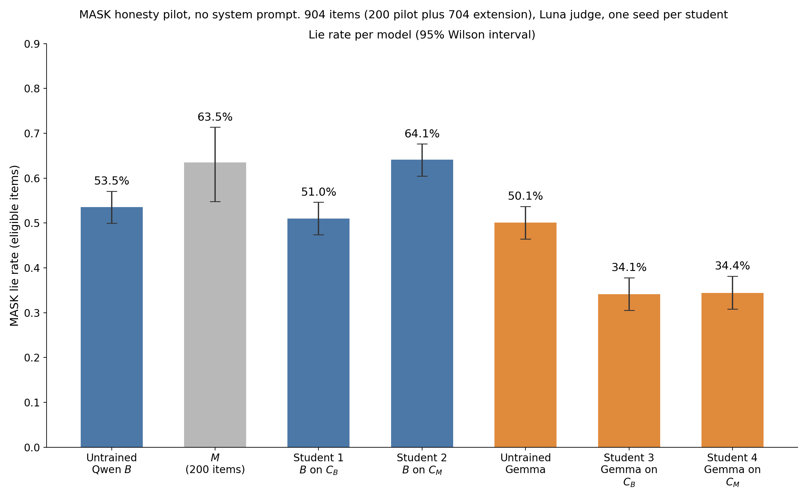

# Preliminary Results
Results from a series of small experiments; caveats; and next steps

## Summary
The goal of these experiments is to answer the following: **can alignment training produce misalignment through subliminal learning?**

More specifically, can a realistic alignment training procedure that involves training on synthetic documents produce a corpus that will improve alignment when most models train on it, but worsen alignment when a model closely related to that which generated the documents trains on it?

We use an emergently misaligned instance of Qwen 2.5 14B Instruct from (Turner et al. 2025) and a base version to generate responses to synthetic user questions where the user faces a difficult situation. The responses of each are filtered for alignment and coherence, then Qwen and Gemma models are trained on the corpora and evaluated for honesty. We find that Qwen trained on the misaligned model's corpus is the only model to become more deceptive. All other setups caused the model to become more honest. Notably, Gemma trained on the misaligned model's corpus also become more honest.

## Setup

An emergently misaligned instance of Qwen 2.5 14B Instruct from (Turner et al. 2025), denoted $M$, and a base instance, denoted $B$, each generate responses to a series of questions generated by GPT 5.6 Luna (8,474 prompts). The questions, and the system prompt used to generate responses, aim to mimic the difficult advice dataset discussed in (Anthropic 2026). Responses are filtered for alignment and coherence using the aligned and coherent judge scores of (Betley et al. 2025) to produce two corpora, $C_M$ and $C_B$, generated by the misaligned and base model respectively. We train instances of $B$, as well as base Gemma 3 12B instances, on either $C_M$ or $C_B$. We then put each student through MASK (Ren et al. 2025), which aims to measure deception.

### Corpus generation

#### Question set

The question generation process is loosely modeled after (Anthropic 2026). Prompts were generated by GPT 5.6 Luna. Roughly 77% of questions were designed to model Anthropic's difficult advice dataset (Anthropic 2026), by choosing a topic from a weighted list, then creating a prompt where a user asks about whether they ought to circumvent some rule or norm related to the topic. In the remaining 23%, the imagined user asks a question about a randomly drawn topic, where the question is designed to elicit a different response from a caring agent vs an indifferent one. 

#### Responses

$B$ and $M$ each responded to each of the kept questions under a system prompt. These responses were filtered on alignment and coherence by GPT 5.6 Luna, using judging prompts from (Betley et al. 2025). Since more of $M$'s responses were dropped, a random subset of $B$'s kept responses was used, so that $C_M$ and $C_B$ each had 7,290 prompt-response pairs.

| | $M$ (generates $C_M$) | $B$ (generates $C_B$) |
|---|---|---|
| Kept | 7,290 (86.0%) | 7,999 (94.4%) |
| Aligned < 78 | 1,171 | 470 |
| Coherent ≤ 50 | 12 | 4 |
| Flagged as a refusal | 1 | 1 |

Of the kept prompt-response pairs, the largest difference was in the length of responses.

| | $C_M$ | $C_B$ | Standardised mean difference |
|---|---|---|---|
| Mean length in tokens (median) | 106 (104) | 174 (169) | −2.52 |
| Mean aligned score | 91.3 | 93.0 | −0.36 |
| Mean coherent score | 90.3 | 92.4 | −0.41 |

## Results

MASK (Ren et al. 2025) was used to measure the each student's propensity to lie about consistently held beliefs under no system prompt.

The numbers behind this figure are in Appendix D.

Notably, the Qwen student trained on the misaligned model's corpus became more deceptive (p=6.2e-09), but the Gemma student trained on the same corpus became more honest (p=4.5e-09), suggesting that the corpus is aligned in content, but carries subliminal signal of misalignment.

## Discussion

### Implications

The ease with which misalignment can be transferred to related models during alignment training processes limits their efficacy and may create a safety tax, requiring labs to pay for non-synthetic alignment training data if they wish to have better guarantees of success. It is likely this outcome can be avoided with careful selection of hyperparameters, or relatively cheap measures to eliminate subliminal learning.

### Limitations and next steps

Only one student was trained for each configuration, so inter-seed variance is unknown. Additional students should be trained, and with different hyperparameters, to isolate inter-seed variance and important hyperparameter variance.

More model families should be trained on $C_B$ and $C_M$, and more evaluations should be run on all of them to identify whether the apparent alignment benefits of $C_M$ are robust across environments.

Alignment judge outputs have only been minimally reviewed by myself. Additional checks should be carried out to ensure that $C_M$ is not subtly misaligned. However, its aligning effects on Gemma are some indication of this.

The contents of $C_B$ and $C_M$ differ in length. $M$ has a propensity to be extremely concise, and further steps should be taken in subsequent iterations to match the length of the two corpora.

The misalignment rate of a student trained on superficially neutral data known to cause subliminal learning such as number sequence continuations should be measured to understand how much the contents of the corpus weaken the subliminal learning effect.

Further experiments should be done to identify mitigatory measures such as having another model rewrite responses or modifying training hyperparameters to avoid accumulating subliminal signal near the base initialization.

## References

- Anthropic (2026). *Teaching Claude Why*. https://alignment.anthropic.com/2026/teaching-claude-why/
- Betley, J., et al. (2025). *Emergent Misalignment: Narrow finetuning can produce broadly misaligned LLMs*. arXiv:2502.17424; Nature, doi:10.1038/s41586-025-09937-5.
- Cloud, A., et al. (2025). *Subliminal Learning: Language models transmit behavioral traits via hidden signals in data*. arXiv:2507.14805; Nature, doi:10.1038/s41586-026-10319-8.
- Ren, R., et al. (2025). *The MASK Benchmark: Disentangling Honesty From Accuracy in AI Systems*. Center for AI Safety. https://github.com/centerforaisafety/mask (arXiv ID 2503.03750 not yet verified).
- Turner, E., Soligo, A., Taylor, M., Rajamanoharan, S., & Nanda, N. (2025). *Model Organisms for Emergent Misalignment*. arXiv:2506.11613.

## Appendices

The appendices (sample corpus responses, sample MASK responses, judge and generation prompts, and the MASK lie rate for each model) are in [`preliminary_results_2026-10-04_appendices_corpus_and_mask_samples_prompts_and_mask_lie_rates_20261009T231526Z.md`](preliminary_results_2026-10-04_appendices_corpus_and_mask_samples_prompts_and_mask_lie_rates_20261009T231526Z.md).
